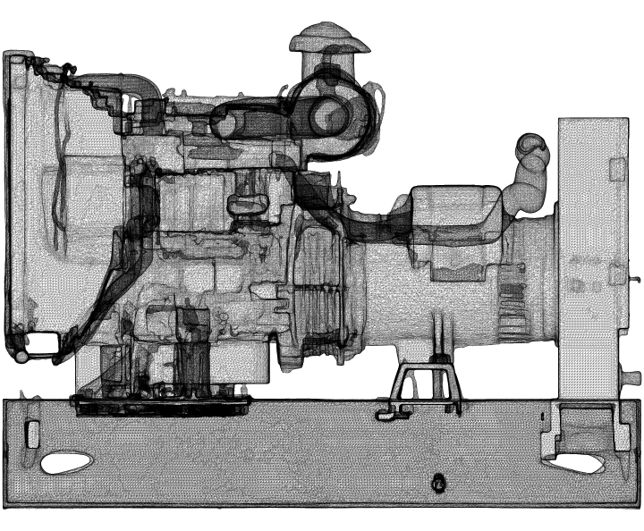
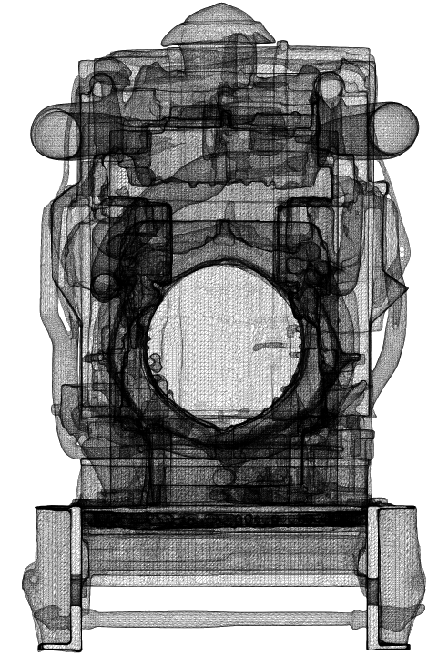
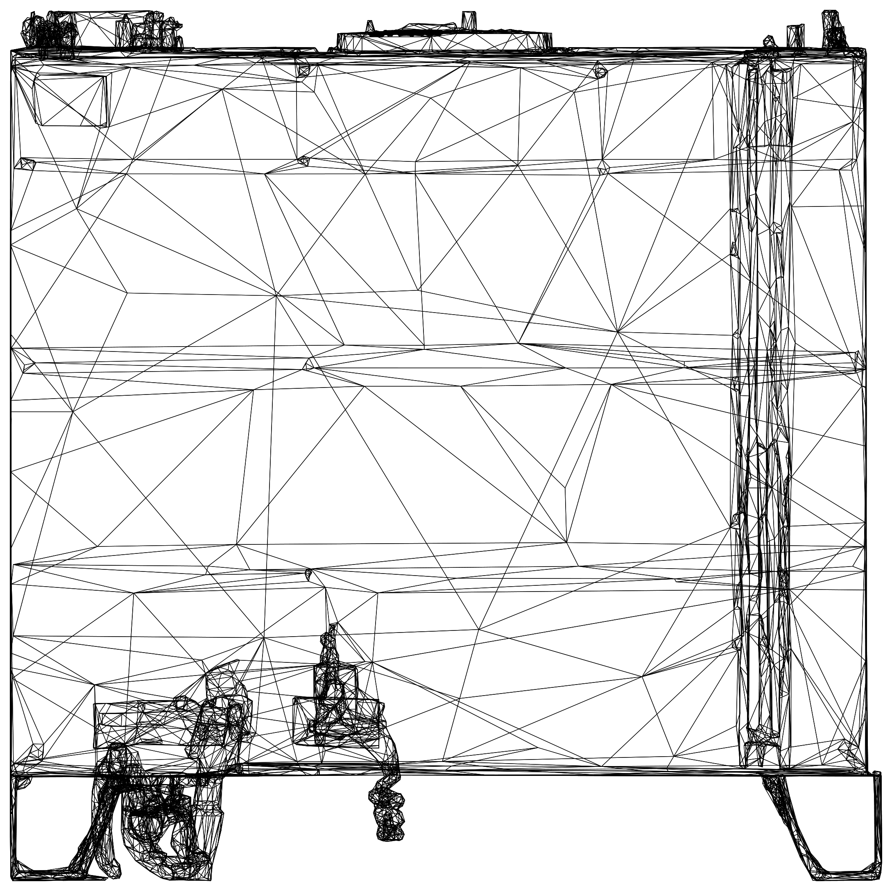
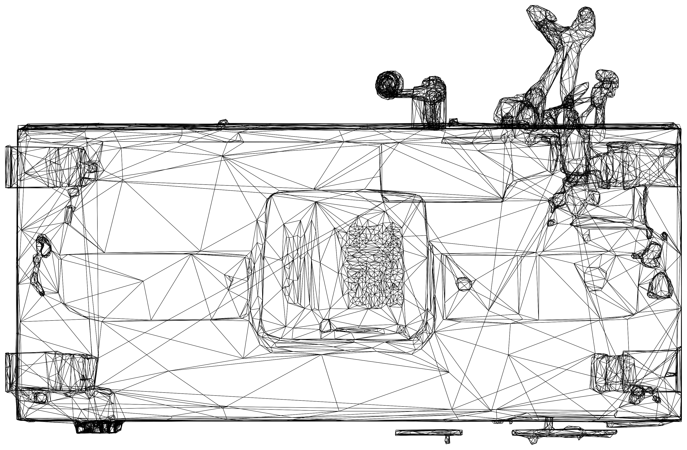
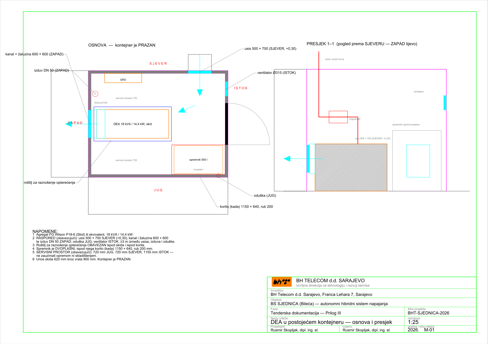
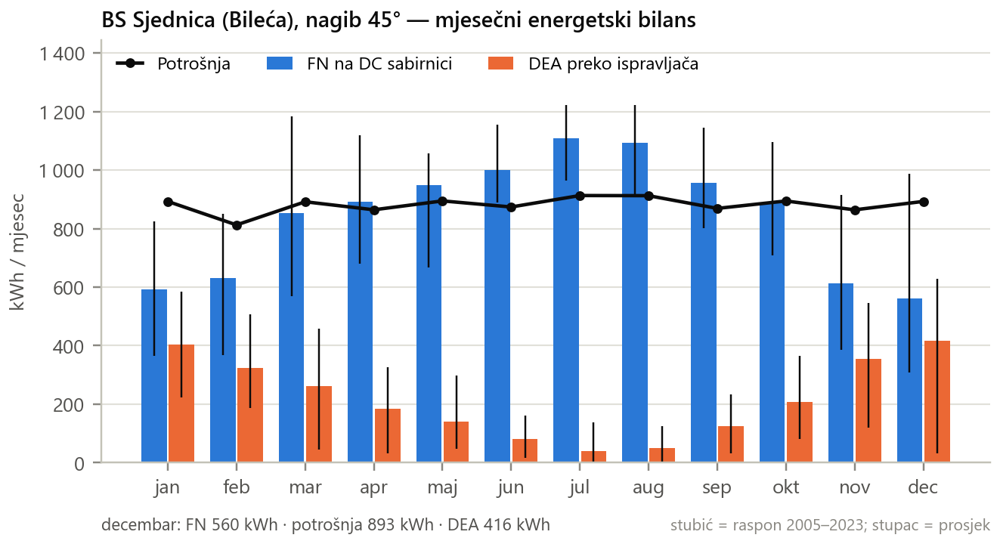
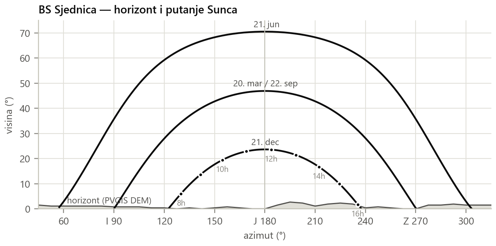

# PRILOG I TD — SPECIFIKACIJA ZAHTJEVA

**Autonomni hibridni sistem napajanja — SJEDNICA (Bileća)**
LOT 1: nosači fotonaponskih panela · LOT 2: dizel električni agregat u kontejneru

**Verzija:** Rev 9, 11.09.2026.

Ovaj Prilog utvrđuje tehničke zahtjeve i dokaze koje Ponuđač dostavlja **UZ PONUDU**
kao uslov kvalifikacije — ponuda koja ih ne sadrži smatra se neprihvatljivom.

U slučaju neslaganja između dokumenata TD mjerodavni su redom: (1) Tenderska
dokumentacija (TD), (2) Prilog I, (3) Prilog II (Predmjer), (4) Prilog III (grafički
prilozi).

Prilog III sadrži i preuzete stranice ranije dokumentacije, koje služe samo kao
podloga; **mjerodavan raspored opreme i otvora u kontejneru je onaj sa crteža M-01.**

---

## 1. Osnovni parametri lokaliteta

| Parametar | Vrijednost/Opis |
|---|---|
| Lokacija | Sjednica, Bileća, BiH |
| Koordinate | 42,9448° N · 18,3236° E |
| Nadmorska visina | 1076 m n.v. |
| Priključak EES | **NE** |
| Bilans potrošnje | Konstantno, 1180 W nazivno / 1330 W maksimalno, −48 V DC |
| Zakupljeni prostor | ≈150 m² (16,00 × 9,40 m) |
| Postojeći objekat | AB ploča 5,40 × 5,40 m, ograda h = 2,10 m, kapija 1,00 m |
| Antenski stub | rešetkasti, h = 38 m, baza 4,20 × 4,20 m |
| Kontejner | 3,00 × 2,30 m vanjski, zidni paneli 60 mm, bez opreme; ulazna vrata 900 × 2000 mm na ISTOČNOM zidu |
| Nosivost poda kontejnera | 10,00 kN/m² ukupno (g+p), ravnomjerno raspodijeljeno — ovjereni projekat lokacije, „04 AG dio", tačka 4.4.2.3 |
| Sistem napajanja | Huawei ICC360-HA1-C1 (PowerCube 1000) i MTS9302A, vanjski ormari smješteni uz SJEVERNI zid kontejnera |
| Uzemljenje | postojeći prstenasti uzemljivač Fe/Zn 25 × 4 mm |

### 1.1 Klimatski i geotehnički uslovi

| Uticaj | Projektna vrijednost | Napomena |
|---|---|---|
| **Vjetar** | **qp ≥ 1,20 kN/m²** (udar 3 s ≈ 45 m/s) | ovjereni projekat lokacije i BAS EN 1991-1-4 + BiH NA, sa orografijom — **mjerodavno dejstvo** |
| Snijeg | prema BAS EN 1991-1-3 + BiH NA | pri nagibu 45° μ₁ = 0,4; uz opaženih ≈0,5 m visine snijega to je ≈0,6 kN/m², upola manje od vjetra. Provjera je obavezna, ali nije mjerodavna |
| **Led** | radijalni 20 mm, gustina 300 kg/m³ | izložen planinski vrh; mjerodavan kao akrecija na profile i spojeve |
| Temperatura | −25 °C do +50 °C | radni opseg opreme |
| Gustina zraka | 1,04–1,09 kg/m³ na 1076 m | derating agregata i dimenzionisanje ventilacije |
| Tlo | kamenito (krš); nosivost ≥100 kPa | Ponuđač potvrđuje geomehaničkim uvidom |
| Smrzavanje | temeljna spojnica ispod dubine smrzavanja | Ponuđač navodi usvojenu dubinu u dnevniku/knjizi |

## 2. Referentni standardi

| Oblast | Standardi |
|---|---|
| Osnove proračuna | BAS EN 1990 |
| Dejstva | BAS EN 1991-1-3 (snijeg), BAS EN 1991-1-4 (vjetar), sa BiH NA |
| Beton i čelik | BAS EN 1992-1-1, BAS EN 1993-1-1, BAS EN 206, EN 10025-2, EN 10219 |
| Geotehnika | BAS EN 1997-1 |
| Izrada čeličnih konstrukcija | EN 1090-1, EN 1090-2 (EXC2) |
| Antikorozivna zaštita | EN ISO 1461 |
| Elektroinstalacije | IEC 60364 (tj. 60364-4-41), BAS EN 60529 |
| Gromobranska zaštita | EN 62305-1 do -4 |
| Prenaponska zaštita | EN 61643-11, EN 61643-21 |
| Fotonaponski sistemi | IEC 62548, IEC 62852 |
| Agregati | ISO 8528-1, ISO 8528-3, ISO 3046-1 |
| Zaštita od požara | važeći propisi RS/BiH; elaborat zaštite od požara |

**Dokumentacija proizvođača opreme:** FG Wilson P18-6 (Skid) TDS 2019-08-14; Huawei
PV Module Solution User Manual; Huawei MTS9300A Telecom Power Installation Guide;
Huawei ICC360-HA1-C1 (PowerCube 1000) Installation Guide.

---

## 3. LOT 1 — Infrastruktura fotonaponskih panela

### 3.1 Konfiguracija

| Parametar | Zahtjev |
|---|---|
| Broj PV nosača | 3 kom × 4 modula |
| Broj PV stringova | 2 stringa × 6 modula (Voc ≈309 V, Imp 13,67 A) — po jedan string na svaku od dvije rute PVDB ormara; string se prostire preko dva nosača |
| Broj PV modula | 12 × 585 Wp = 7,02 kWp; 4 modula po nosaču, 2 reda × 2 stupca, portret |
| Tip PV modula | Huawei iPV585-M2A (2278 × 1134 × 30 mm) |
| Nagib | fiksno 45° |
| Azimut | 180° (JUG) |
| Širina PV polja | 2305 mm (poprečna greda 2918 mm, bočni prepust 306,5 mm) |
| Dužina PV polja po nagibu | 4576 mm (2 × 2278 mm) |
| Horizontalna projekcija | 3236 mm pri 45° |
| Donja / gornja ivica | **+0,50 m / +3,74 m** |
| Nadvišenje ograde | 1,64 m iznad kote ograde h = 2,10 m |
| Površina izloženosti vjetru | 10,55 m² po nosaču |

### 3.2 Projektna opterećenja konstrukcije

**Izrada konstrukcije:** zahtijeva se **CUSTOM IZRADA** konstrukcije dimenzionisana i
dokazana za stvarna opterećenja i uticaje na lokalitetu. Nijedan kataloški nagib
Huawei nosača tipa A nije usklađen sa qp lokacije (deklarisano 0,52–0,87 kN/m² prema
zahtijevanih 1,20 kN/m²).

| Parametar | Zahtjev |
|---|---|
| Pritisak vjetra | qp ≥ 1,20 kN/m² (udar 3 s ≈ 45 m/s) |
| Koeficijent sile | cf ≥ 1,5 pri 45° prema EN 1991-1-4 §7.3 |
| Površina izloženosti vjetru | 10,55 m² po nosaču |
| Sila podizanja po nosaču | ≥18,1 kN (GSN, γQ = 1,5 / γG,fav = 0,9) |
| Horizontalna sila po nosaču | ≥13,4 kN (GSN) |
| **Moment prevrtanja po nosaču** | **≥42,6 kNm (GSN)** |
| **Spreg po temeljnoj traci** | **≥26,6 kN** pri razmaku traka 1600 mm |
| Mjerodavno | podizanje (uplift) i prevrtanje, a NE nosivost tla |

### 3.3 Materijal i izrada konstrukcije

| Element | Zahtjev |
|---|---|
| Konstrukcijski čelik | S275JR (S355JR za stubove) prema EN 10025-2 |
| Profili | šuplji profili prema EN 10219; stubovi min. RHS 80 × 80 × 4, rigle min. RHS 60 × 40 × 3, ili presjek sa dokazano najmanje jednakim otpornim momentom |
| Antikorozivna zaštita | vruće cinčanje prema EN ISO 1461, min. 70 µm lokalno / 85 µm srednje (C4) |
| Zavarivanje | EN 1090-2, klasa izvedbe EXC2; zavarivači prema EN ISO 9606-1 |
| Označavanje | CE i izjava o svojstvima prema EN 1090-1 |
| Konstrukcijski vijci | M16 klase 8.8, cinčani, prema EN 15048 |
| Pričvršćenje modula | nehrđajući A2/A4; stezaljke za debljinu modula 30 mm |
| Zaštita od krađe | antitheft matice na stezaljkama modula |
| Moment pritezanja | prema uputstvu proizvođača (45 N·m za Huawei) |

### 3.4 Sidrenje

| Element | Zahtjev |
|---|---|
| Tip | hemijski (epoksidni/vinilesterski) anker M16 ili M20, sa ETA odobrenjem |
| Materijal | vruće cinčan ili nehrđajući A4 |
| Broj | min. 2 ankera po temeljnoj traci, odnosno 4 po nosaču |
| Nosivost | karakteristična sila čupanja ≥30 kN po ankeru |
| Dubina ugradnje | prema ETA za konkretnu podlogu (beton / stijena) |
| **Projektna sila** | ukupno podizanje po nosaču ≥18,1 kN; **sila po traci od momenta prevrtanja ≥26,6 kN** pri razmaku traka 1600 mm — ovo je mjerodavno opterećenje sidrenja |
| Dokazivanje | ispitivanje čupanjem (pull-out) na ≥10 % ugrađenih ankera, min. 2 po nosaču, do 1,5 × projektne sile, uz zapisnik ovjeren od nadzornog organa |
| Alternativa | livena U-sidra M16/320 dozvoljena SAMO uz gravitacioni temelj ≥0,75 m³ po nosaču — moment prevrtanja i dalje zahtijeva provjeru |

### 3.5 Temelji nosača

| Element | Zahtjev |
|---|---|
| Beton | C30/37, klasa izloženosti XC4 + XF3, aerant 4–6 %, Dmax 16, S3 |
| Podložni beton | C12/15, d = 50 mm |
| Armatura | B500B, zaštitni sloj ≥50 mm |
| Geometrija | 2 trake po nosaču (×3 nosača = **6 traka ukupno**), 450 mm (gore) / 550 mm (dolje) × 3300 mm, **pune dubine 900 mm**, razmak 1600 mm, pravac SJEVER–JUG |
| **Zapremina** | **1,485 m³ po traci → 8,91 m³ ukupno** |
| Smještaj | **IZVAN ograđenog platoa**, južno od ograde. Odmak od ograde Ponuđač utvrđuje pri poziciranju nosača tako da ravan panela nigdje ne dodiruje ogradu, a konstrukcija u cijelosti ostane unutar zakupljene parcele 16,00 × 9,40 m |
| Dubina smrzavanja | temeljna spojnica ispod dubine smrzavanja; Ponuđač navodi vrijednost |

**Traka se betonira punom dubinom rova.** Vlastita težina trake je dio dokaza
sigurnosti na podizanje: `1,485 m³ × 24 kN/m³ × 0,9 = 32,1 kN` prema traženih 29,6 kN
po traci. Traka manje zapremine tu provjeru ne zatvara vlastitom težinom.

### 3.6 Uzemljenje (LOT 1)

- povezivanje **sva tri nosača** na postojeći prstenasti uzemljivač Fe/Zn 25 × 4 mm
- vodič: bakarno uže ≥50 mm² prema EN 62305-3, Tabela 7, otporno na UV i ukopavanje
- **NIJE dozvoljen** H07V-K 25 mm² (unutrašnji instalacioni vodič)
- bimetalni (Cu/Fe-Zn) ukrsni komadi otporni na galvansku koroziju
- kontinuitet spojeva ≤0,1 Ω; ukupni otpor uzemljenja ≤10 Ω
- DC kablovi na razmaku ≥0,5 m od odvoda gromobranske instalacije

---

## 4. LOT 2 — Dizel električni agregat i instalacije

### 4.1 Agregat

| Parametar | Zahtjev / referentna vrijednost |
|---|---|
| Snaga | 18 kVA / 14,4 kW standby, 400/230 V, 50 Hz |
| Referentni tip | FG Wilson P18-6 ili ekvivalent |
| Motor | Perkins 404D-22G1 ili ekvivalent, 4-cilindarski, 2,2 l, 1500 o/min |
| Izvedba | za montažu u prostor (skid, bez vlastitog kućišta) |
| Dimenzije | 1550 × 620 × 1020 mm (referentno ±5 %) |
| Masa | 365 kg suho / 372 kg mokro (referentno) |
| Derating | na 1076 m n.v. i temperaturu okoline do +40 °C (ISO 3046-1); Ponuđač dostavlja derating proizvođača |
| **Uzbuda (OBAVEZNO)** | nezavisna pobuda — **PMG ili AREP/AUX** namotaj; trajna struja kratkog spoja **≥3 × In (≈78 A)** u trajanju ≥10 s prema ISO 8528-3. Standardna SHUNT pobuda **NIJE prihvatljiva** |
| Antivibracioni elementi | gumeno-metalni oslonci, vlastita frekvencija ≤8 Hz, statički progib ≥5 mm, između skida i roštilja iz Tačke 4.2; **svi priključci na motor elastični** — izduv, hladnjak i **oba voda goriva** |

{width=60%}

{width=42%}

### 4.2 Spremnik goriva i oslanjanje opreme

- metalni, **dvoplašni**, zapremine **500 l**, sa nivo sondom i detekcijom curenja
  goriva u međuplaštu
- referentne dimenzije 1050 × 600 × 1310 mm, masa cca 170 kg — pun ≈590 kg na
  0,63 m² = 9,2 kN/m²; unutar projektnih 10,00 kN/m²
- **OBAVEZAN čelični ram/roštilj za raznošenje opterećenja** pod DEA i pod koritom sa
  spremnikom, sa prenosom na primarne nosače podne konstrukcije. Opterećenja su
  koncentrisana na mali broj sekundarnih nosača (HOP 100 × 50 × 3 na 0,51 m), dok se
  10,00 kN/m² odnosi na ravnomjerno raspodijeljeno opterećenje
- **sekundarnu zaštitu čini međuplašt** dvoplašnog spremnika sa sondom za detekciju
  curenja, pa tankvana zapremine ≥110 % **NIJE zahtijevana**. Ispod spremnika se
  izvodi **prihvatno korito (kada) 1150 × 640 mm, visina ruba 200 mm**, za prihvat
  kapanja i prosipanja, sa vidljivim najnižim mjestom za kontrolu i pražnjenje
- vanjski priključak za tankanje sa zaštitom od statičkog elektriciteta i
  sprječavanjem prelijevanja
- odušna cijev izvan kontejnera, sa plamenobranom, udaljena ≥3 m od izduva i usisa
  zraka
- protupožarni ventil na izlazu iz spremnika (topljivi osigurač ili solenoid),
  aktiviran požarom i E-STOP-om
- napajanje motora gorivom Cu cijevima NO 8 mm (polazni i povratni vod), sa
  **fleksibilnim umetkom na oba voda neposredno uz motor**
- sifon protiv povratnog toka

{width=55%}

{width=62%}

### 4.3 Ventilacija i hlađenje

Dimenzionisano prema tehničkom listu proizvođača. Mjerodavno ograničenje je
**maksimalni vanjski otpor strujanju zraka od 125 Pa** za cjelokupnu putanju.

| Parametar | Vrijednost |
|---|---|
| Zrak hladnjaka | 1980 m³/h (33 m³/min) — ostvaruje vlastiti ventilator hladnjaka; korigovano na gustinu lokacije 2151 m³/h |
| Zrak za sagorijevanje | 90 m³/h; max. otpor usisa 3 kPa |
| Maks. vanjski otpor | **125 Pa** (ukupno: usis + kanal + izlaz) |
| **Toplota u prostor** | **5,8 kW** (uz 15,2 kW odvedenih rashladnom tečnošću i uljem) |
| Usisna žaluzina | 500 × 700 mm (v ≈ 3,56 m/s, Δp ≈ 17 Pa) |
| **Kanal hladnjaka** | prelazni komad od prirubnice hladnjaka do izlazne žaluzine, **razvijena površina ≈1,0 m²**, od pocinčanog lima d = 1 mm |
| Izlazna žaluzina | 600 × 600 mm (v ≈ 3,46 m/s, Δp ≈ 16 Pa) |
| Ventilator prostora | 1200 m³/h, Ø315, vođen termostatom i kontrolerom DEA, blokiran sa aktiviranjem gašenja požara |
| Provjera | Izvođač dostavlja proračun pada pritiska ukupne putanje |

**Raspored otvora** (prema crtežu M-01, Prilog III):

| Element | Zid i položaj |
|---|---|
| Usisna žaluzina 500 × 700 | **SJEVERNI zid, istočni kraj**; donja ivica +0,30 m od poda. Sjeverna strana je zasjenjena i daje najhladniji usisni zrak; žaluzina se postavlja istočno od vanjskih ormara ICC360-HA1-C1/MTS9302A |
| Kanal hladnjaka + izlazna žaluzina 600 × 600 | **ZAPADNI zid**, na osi hladnjaka agregata; kanal najkraćim putem od hladnjaka kroz zid |
| Izduv | uz **ZAPADNI zid**, završetak iznad krova (Tačka 4.4) |
| Odušna cijev spremnika | **JUŽNI zid**, istočni kraj |
| Ventilator prostora Ø315 | **ISTOČNI zid**, gore (donja ivica ≈+1,75 m), sjeverno od ulaznih vrata |
| Minimalna razdaljina | ≥3 m prostorno između usisa zraka, izduva i odušne cijevi |

{width=100%}

Otvori se izvode kroz **ZIDNE PANELE** kontejnera. Raspored je ukrsni
(**usis SJEVER → agregat → izlaz ZAPAD**). Nije dozvoljeno izvesti usis, izlaz i
izduv na istom zidu, niti usmjeriti topli zrak ili izduv prema SJEVERNOJ strani, gdje
su vanjski ormari i usis svježeg zraka. Nije dozvoljeno izvesti dovod zraka kroz
ulazna vrata.

### 4.4 Izduvni sistem

| Parametar | Vrijednost |
|---|---|
| Protok izduvnih gasova | 192 m³/h (3,2 m³/min) pri 413 °C |
| Maks. dozvoljeni protutlak | 10,2 kPa |
| **Dijametar** | **NO 50** — pri 192 m³/h i 413 °C brzina je 27,2 m/s (< 30 m/s), protutlak ≈1,9 kPa uz dozvoljenih 10,2 kPa. Prečnik određuje brzina, ne protutlak |
| Prigušivač | industrijski; **hvatač iskri obavezan** |
| Fleksibilni priključak | neposredno iza motora |
| Trasa i dužine | 1 m od elastičnog umetka do prigušivača sa jednim lukom 90°; do 4 m od prigušivača do izlaza, uspon uz **ZAPADNI zid** kontejnera |
| Izolacija | kamena vuna d = 50 mm + Al lim d = 1 mm, razvijena površina **≈3,0 m²**; boja otporna na 600 °C |
| Završetak | **iznad krova, usmjeren naviše**, sa kapom protiv upada padavina, ≥3 m od usisa zraka i odušne cijevi |
| Provjera | Ponuđač dostavlja proračun protutlaka |

### 4.5 Elektroinstalacije i zaštite

Zahtijeva se **NEZAVISNA POBUDA** generatora (PMG ili AREP/AUX) sa 3 × In u trajanju
≥10 s (Tačka 4.1), kao i zaštita zaštitnom strujnom sklopkom (RCD) kao glavnim
sredstvom zaštite od indirektnog dodira.

| Element | Zahtjev |
|---|---|
| Nazivna struja | **In = 26,0 A** pri 18 kVA / 400 V |
| Struja kvara (SHUNT) | prva poluperioda ≈333 A (12,8 × In) → prelazna ≈169 A (6,5 × In) → **TRAJNA ≈13 A (0,5 × In)** — ne aktivira zaštitu (**ne zadovoljava**) |
| **Struja kvara (PMG/AREP)** | **≥78 A (3 × In) trajno ≥10 s — ZAHTIJEVANO** |
| Sistem zaštite | TN-S, jedinstvena tačka spajanja N i PE u novom GRO |
| Glavna zaštita | 4p RCD 63 A / 300 mA, S-tip (selektivna) |
| Krajnji strujni krugovi | 2 × RCBO 16 A / 30 mA, tip A (utičnice, rasvjeta) |
| Sklopka izvora | 4p 63 A, položaji 1 – agregat / 0 – isključeno / 2 – rezerva |
| SPD, AC strana | **tip 1 + 2** (Iimp ≥12,5 kA) — objekat ima vanjski LPS |
| SPD, DC strana | tip 2 po stringu (Iimp ≥5 kA, Ucpv ≥425 V), na PVDB i na polju |
| SPD, signalni vodovi | prema EN 61643-21 (obavezno za stub h = 38 m) |
| Postojeći strujni krugovi | snimiti stanje i prevezati svih 7 postojećih krugova u novi GRO; signalna rasvjeta antenskog stuba (K7) na zasebnom nadziranom krugu |
| AC kablovi | bezhalogeni, CPR ≥ Cca-s1b,d1,a1 |
| DC kablovi | H1Z2Z2-K 6 mm²; priključak na iSSU presjekom 4 mm² |
| Otpor uzemljenja | ≤10 Ω |

### 4.6 Parametriranje upravljanja i nadzora (DEA + PV + baterije)

- start agregata prema **stanju napunjenosti baterija (SoC)**, a ne prema ispadu mreže
  — lokacija nema priključak EES
- **ograničenje ulazne snage ispravljačkog sistema na maks. 9,5 kW dok agregat radi.**
  Derativana prime snaga agregata na lokaciji je 11,6 kW, a neograničen ispravljački
  sistem vuče ≈12,5 kW. Granica ujedno drži agregat iznad 30 % opterećenja i
  sprječava mokri rad motora
- **parametriranje SMU za minimalan rad agregata (OBAVEZNO)** — dokazuje se protokolom
  iz Tačke 5, stavka 12:
  - start agregata pri dubini pražnjenja baterija **DOD 85 %** (SoC 15 %)
  - zaustavljanje agregata pri **SoC 60 %** — ostatak punjenja preuzima fotonaponsko
    polje; punjenje baterija agregatom do vrha povećava rad agregata za 12–17 %
  - struja punjenja baterija podešena tako da ne ograničava agregat ispod 9,5 kW: na
    najveću vrijednost koju dozvoljava BMS baterijskih modula (proračun pretpostavlja
    0,5 C), uz pisanu potvrdu proizvođača
  - najkraće vrijeme rada agregata po startu **1 h**
- prijenos alarma u sistem daljinskog nadzora: rad agregata, kvar, nivo goriva,
  curenje goriva, požar, temperatura prostora
- upravljačka jedinica kompatibilna sa postojećim sistemom napajanja (modul GIM01C1,
  AC ulazni modul AIU03)

### 4.7 Zaštita od požara

- elaborat zaštite od požara za prostor sa 500 l dizel goriva — tokom primopredaje
- detekcija: dimni i termički detektori; detekcija CO i NO₂
- automatsko gašenje sredstvom za klasu B, sa **blokadom ventilacije pri aktivaciji**
- protupožarni ventil na izlazu iz spremnika
- E-STOP izvan kontejnera pored ulaznih vrata, prema ISO 13850 kategorija 0
- oznake opasnosti, zabrana pušenja, oznaka kapaciteta goriva
- najmanje dva aparata za gašenje odgovarajuće klase

Elaborat zaštite od požara, protupožarni ventil na spremniku i blokada ventilacije pri
aktivaciji gašenja **zasebno su iskazani u Prilogu II**.

---

## 5. Dokazi koji se dostavljaju

Dokazi koji se dostavljaju **uz ponudu** nose oznaku **PONUDA**; dokazi koji se
dostavljaju **u toku realizacije** nose oznaku **REALIZACIJA**; dokazi koji se
dostavljaju komisiji **tokom primopredaje** nose oznaku **PRIMOPREDAJA**.

| Br. | Dokaz | LOT | Oznaka |
|---|---|---|---|
| 1 | Statički proračun nosive konstrukcije i temelja za qp ≥ 1,20 kN/m² pri 45°, ovjeren i potpisan od ovlaštenog inženjera, sa dokazom na podizanje i prevrtanje | 1 | REALIZACIJA |
| 2 | Tehnički nacrti konstrukcije i temelja | 1 | PONUDA |
| 3 | Izjava o svojstvima prema EN 1090-1 i klasa izvedbe EXC2 | 1 | REALIZACIJA |
| 4 | Atesti materijala (čelik) i potvrda o vrućem cinčanju (debljina sloja) | 1 | REALIZACIJA |
| 5 | ETA certifikat i proračun za hemijska sidra | 1 | REALIZACIJA |
| 6 | Zapisnik o ispitivanju ankera na čupanje (min. 10 %) | 1 | REALIZACIJA |
| 7 | Tehnički list (TDS) agregata sa dokazom o PMG/AREP nezavisnoj pobudi (3 × In, ≥10 s) | 2 | PONUDA |
| 8 | Proračun pada pritiska ventilacije i protutlaka izduvnog sistema | 2 | REALIZACIJA |
| 9 | Elaborat zaštite od požara za prostor sa rezervoarom 500 l | 2 | REALIZACIJA |
| 10 | Atesti i certifikati za elektro opremu, CPR kablove i prenaponsku zaštitu (SPD) | 2 | REALIZACIJA |
| 11 | Ispitni protokoli elektroinstalacija i otpora uzemljenja (≤10 Ω) | 2 | PRIMOPREDAJA |
| 12 | Protokol o parametriranju i funkcionalnom ispitivanju integracije DEA–PV–baterija, uključujući postavljeno ograničenje od 9,5 kW, start pri DOD 85 %, stop pri SoC 60 %, struju punjenja uz potvrdu proizvođača baterija i najkraće vrijeme rada | 2 | PRIMOPREDAJA |

## 6. Ispitivanja i puštanje u rad

| Ispitivanje | Kriterij |
|---|---|
| Otpor uzemljenja | ≤10 Ω |
| Kontinuitet zaštitnih vodiča | ≤0,1 Ω po spoju |
| Ispitivanje čupanja ankera | ≥10 % ankera, do 1,5 × projektne sile |
| Funkcionalno ispitivanje RCD | vrijeme i struja isključenja prema IEC 61008/61009 |
| Ispitivanje ventilacije | izmjereni pad pritiska ≤125 Pa |
| Funkcionalno ispitivanje agregata | automatski start/stop, zaštite, alarmi |
| Probni rad | 72 h neprekidnog rada sa simulacijom opterećenja |
| Mjerenje temperature prostora | pri radu agregata na nazivnom opterećenju |

## 7. Garancija

- garantni period minimalno **24 mjeseca** od zapisnika o primopredaji bez primjedbi
- postgarantni period minimalno **5 godina**
- spisak preporučenih rezervnih dijelova za 500 h rada agregata
- dokumentacija izvedenog stanja i uputstva za pogon i održavanje

---

## 8. Očekivani energetski bilans (informativno)

Satna simulacija energetskog bilansa na −48 V DC sabirnici za 19 godina (2005–2023):
ozračenje lokacije iz PVGIS-SARAH3, FN lanac sa gubicima po komponentama (uključujući
krivulju efikasnosti iSSU S4875G2), baterije 48,6 kWh (6 × 150 Ah) i agregat preko ispravljača
ograničenih na 9,5 kW, uz parametriranje SMU iz Tačke 4.6. Metoda, provjera prema
PVGIS-u, gubici i osjetljivost na postavke su u Proračunima, dio A.6. **Vrijednosti su
informativne i ne mijenjaju zahtjeve Tačaka 3 i 4.**

| Pokazatelj | Vrijednost |
|---|---|
| FN proizvodnja na DC sabirnici | ≈10 140 kWh/god (1 444 kWh/kWp) |
| Potrošnja | ≈10 570 kWh/god (1180 W TK + hlađenje ormara i pomoćna potrošnja) |
| Decembar | FN ≈560 kWh prema potrošnji ≈890 kWh — razliku pokriva agregat |
| Solarni udio u potrošnji | 79,8 % |
| **Rad agregata** | **≈230 h/god** u prosjeku; u 9 od 10 godina do ≈290 h; najviše ≈310 h |
| Startova agregata | ≈80 godišnje, najviše ≈110 |
| **Potrošnja goriva** | **≈770 l/god**; spremnik od 500 l dopunjava se dva puta godišnje |
| Nepokrivena potrošnja | 0 |

Bez parametriranja iz Tačke 4.6 (zaustavljanje pri SoC 90 %, uobičajena struja
punjenja) agregat bi radio ≈260 h i trošio ≈870 l goriva godišnje.

{width=100%}

{width=100%}
